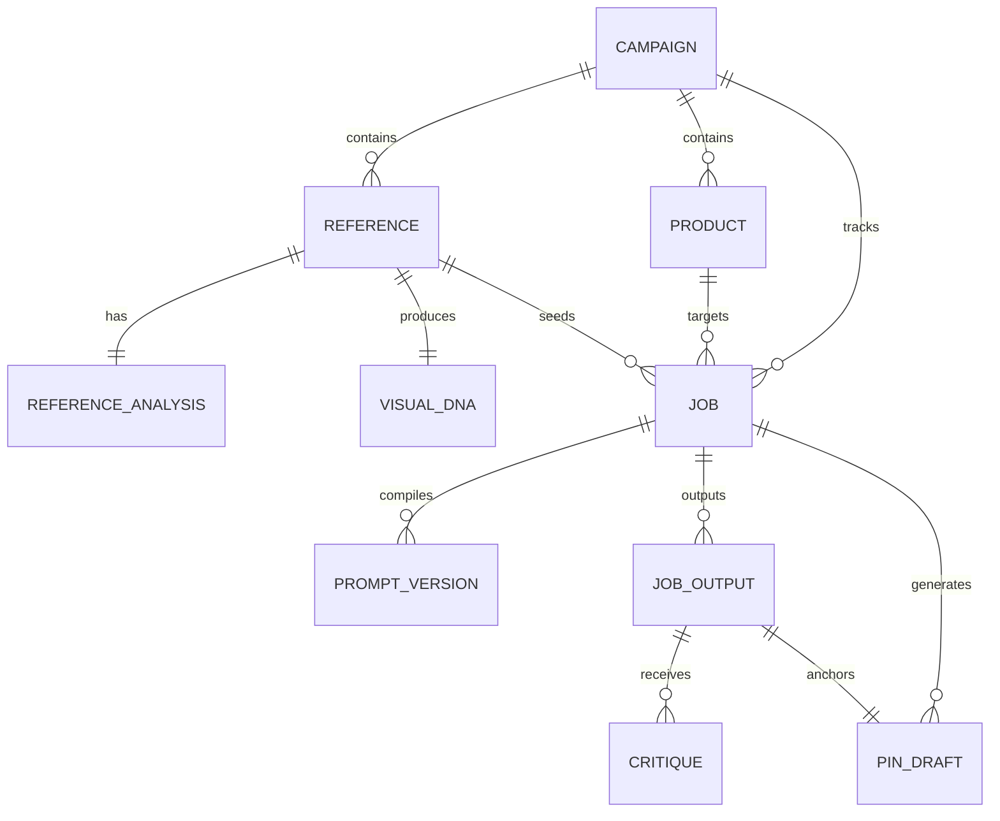
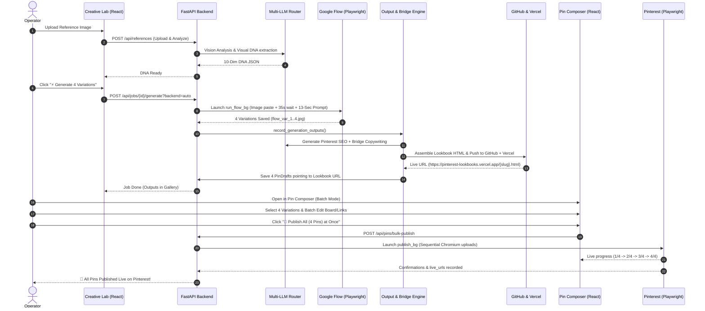

# PINTEREST REALISM ENGINE (PRE) — COMPLETE ARCHITECTURAL KNOWLEDGE BASE & AI CONTEXT

> **Authoritative System Source:** Verified from active source code across `app/`, `frontend/`, `scripts/`, `data/`, and live production deployments as of **August 2026**.
> This document is the single source of truth for all AI agents and developers working on this codebase.

---

## 1. Executive Summary & System Vision

**Pinterest Realism Engine (PRE)** is an automated, zero-API-cost affiliate marketing platform designed to turn single lifestyle product images into profitable, high-converting Pinterest affiliate campaigns.

### The Full Autonomous Lifecycle:
1. **Reference Ingestion:** Upload any Pinterest lifestyle photo $\rightarrow$ Vision AI extracts structured **Visual DNA** (lighting, camera physics, textures, scene composition).
2. **13-Section Sensory Prompting:** AI Scene Director pairs Visual DNA with Product Taxonomy to compile a forensic 13-section UGC prompt infused with realism modules.
3. **Google Flow Multi-Variation Generation:** Headless/Visible Chromium automator pastes the reference image into Google Flow, waits 35s for full upload processing, types the 13-section prompt, and extracts **4 vertical 9:16 variations**.
4. **Automated UGC Lookbook Bridge Pages:** A single deterministic generator compiles an interactive 12-column responsive HTML Lookbook showcasing all 4 variations, with tactile wear-test reviews, pros/cons, and staged Amazon/affiliate CTA buttons.
5. **Git-Backed Cumulative Vercel Deployment:** The Lookbook is automatically committed to GitHub (`https://github.com/NizamuddinSameer-1/pinterest-lookbooks.git`) and deployed to Vercel with zero 404 snapshot deletions, updating the live `index.html` catalog directory.
6. **Multi-Pin Studio & Batch Publisher:** The operator selects 2–4 generated variations in the React Pin Composer, edits titles/descriptions/boards/links individually or in bulk, and triggers a single autonomous Playwright browser session to publish or schedule all pins directly to Pinterest.

---

## 2. Technology Stack & Runtime Specifications

| Layer | Technology | Exact Version / Details |
|---|---|---|
| **Backend Framework** | FastAPI + Uvicorn | `fastapi==0.115.0`, `uvicorn[standard]==0.30.6` |
| **Validation & Settings** | Pydantic v2 | `pydantic==2.9.0`, `pydantic-settings==2.5.0` |
| **Database & ORM** | SQLite + SQLAlchemy 2.0 (Async) | `sqlalchemy==2.0.35`, `aiosqlite==0.20.0` with `PRAGMA journal_mode=WAL` |
| **Browser Automation** | Microsoft Playwright | `playwright>=1.47.0` (Chromium driver with persistent browser profiles) |
| **Vision & Text LLMs** | Unified Multi-Provider | OpenCode Zen (Qwen 2.5 Coder 32B), NVIDIA NIM (Nemotron / Llama 3.1 70B), Google Gemini 2.5 Flash |
| **Image Processing** | Pillow (PIL) | In-memory WebP base64 compression & clipboard PNG formatting |
| **Template Engine** | Jinja2 | `jinja2>=3.1.4` (for `bridge_page.html` and `catalog_index.html`) |
| **Frontend Framework** | React 18 + Vite + TypeScript | React 18, Vite 5.4, Lucide React icons, Vanilla CSS Design System |
| **Hosting & Deployments** | Vercel Edge + GitHub | Git-backed auto-commit & Vercel REST API (`/v13/deployments`) |
| **Operating System** | Windows (x64) | Strict requirement: `asyncio.WindowsProactorEventLoopPolicy()` |

---

## 3. Directory & Repository Map

```
Pinterest Affilate System/
├── app/
│   ├── main.py                  # FastAPI application entry, CORS, lifespan, router mounting
│   ├── config.py                # Pydantic Settings (.env loader with override=True)
│   ├── database.py              # Async SQLAlchemy engine with SQLite WAL PRAGMA hooks
│   ├── api/                     # REST API Endpoints
│   │   ├── jobs.py              # Job lifecycle (create, scene, compile, outputs, critique, rework)
│   │   ├── generation.py        # POST /api/jobs/{id}/generate (auto multi-backend dispatch & polling)
│   │   ├── pins.py              # PinDraft CRUD, single publish, bulk-publish, bulk-schedule, board catalog
│   │   ├── references.py        # Reference image upload, vision analysis, Visual DNA extraction
│   │   ├── lookbooks.py         # GET /lookbooks/{slug}, POST /api/jobs/{id}/lookbook
│   │   ├── debug.py             # System status, recent errors, live LLM & browser session probes
│   │   └── campaigns.py         # Campaign grouping
│   ├── models/
│   │   └── models.py            # SQLAlchemy async declarative models (10 tables)
│   ├── schemas/
│   │   └── schemas.py           # Pydantic request/response validation schemas
│   ├── pipeline/                # Prompt Engineering & Vision Logic
│   │   ├── reference_analyst.py # Vision analysis extracting 10 dimensions of photographic realism
│   │   ├── visual_dna.py        # Stable Visual DNA compiler & schema
│   │   ├── product_taxonomy.py  # 23 ProductClass categories & classification engine
│   │   ├── scene_director.py    # Psychology-driven scene setting & consumer desire framing
│   │   ├── prompt_compiler.py   # 13-section sensory prompt assembler injecting 1000 modules
│   │   ├── prompt_modules.py    # 1000 realism modules registry
│   │   ├── realism_critic.py    # Forensic AI critic assessing PASS vs REWORK
│   │   ├── rework_engine.py     # PRESERVE/FIX/AVOID prompt modifier
│   │   └── pinterest_seo.py     # High-CTR title, description, keyword & board generator
│   ├── providers/
│   │   └── llm.py               # Unified multi-LLM router with automatic fallback & quota handling
│   ├── services/                # Core Business & Infrastructure Services
│   │   ├── flow_automator.py    # Playwright automator for Google Flow (image paste, prompt entry, variation capture)
│   │   ├── flow_api_client.py   # Direct HTTP API runner using captured sessions
│   │   ├── pollinations_client.py # Fallback image generator
│   │   ├── generation.py        # Multi-backend coordinator (flow_api -> flow_ui -> pollinations)
│   │   ├── output_service.py    # Output recorder + automatic Lookbook trigger + PinDraft generator
│   │   ├── bridge_copilot.py    # Taxonomy-aware UGC copywriter generating structured review data
│   │   ├── article_generator.py # Deterministic HTML assembler with WebP compression (<100KB per image)
│   │   ├── git_publisher.py     # Dedicated Git repository manager for data/lookbooks/ (auto-push to GitHub)
│   │   ├── vercel_publisher.py  # Multi-lookbook cumulative edge deployer (REST API + Git push)
│   │   ├── pinterest_publisher.py # Playwright Chromium driver for Pinterest pin builder & native scheduler
│   │   ├── publish_runs.py      # Background worker process manager (spec.json / status.json IPC)
│   │   ├── schedule_planner.py  # Mathematical spacing planner for Pinterest bulk scheduling
│   │   ├── scheduler.py         # In-process queue worker for local scheduled pins
│   │   ├── board_catalog.py     # Cache and validator for Pinterest account board names
│   │   ├── error_diagnostics.py # 7-subsystem diagnostic health checker
│   │   └── vault_sync.py        # Obsidian vault bi-directional markdown synchronization
│   └── templates/
│       ├── bridge_page.html     # Responsive 12-column Jinja2 Lookbook landing page template
│       └── catalog_index.html   # Master directory index template for lookbook catalog
├── frontend/                    # React 18 + Vite SPA
│   ├── src/
│   │   ├── App.tsx              # Main layout, tab navigation, notifications
│   │   ├── api.ts               # Complete typed frontend API client
│   │   └── components/
│   │       ├── CreativeLab.tsx  # Reference upload, DNA analysis, 4-variation gallery, prompt preview
│   │       ├── PinComposer.tsx  # Multi-pin selection, batch metadata editing, batch 1-click publishing
│   │       ├── Dashboard.tsx    # Campaign overview and metrics
│   │       ├── DiagnosticsModal.tsx # Interactive health check & subsystem debugging modal
│   │       └── VaultHub.tsx     # Obsidian notes status
├── data/                        # File Storage & Run Artifacts
│   ├── pre.db                   # SQLite database
│   ├── lookbooks/               # Generated Lookbook HTML, OG images, index.html (Git repo on branch main)
│   ├── outputs/<job_id>/        # Generated variation images (flow_var_1.jpg ... flow_var_4.jpg)
│   ├── publish_runs/<run_id>/   # Background publisher run specs and status tracking
│   ├── flow_profile/            # Persistent Chrome browser profile for Google Flow
│   └── pinterest_profile/       # Persistent Chrome browser profile for Pinterest session
├── scripts/                     # Background Processes & CLI Utilities
│   ├── publish_bg.py            # Standalone child process running Playwright for Pinterest publishing
│   ├── run_flow_bg.py           # Standalone child process running Playwright for Google Flow generation
│   ├── test_lookbook_generator.py # 7-step E2E verification test for lookbook & deployment pipeline
│   ├── watch_generations.py     # Terminal tail watcher for image generation jobs
│   ├── watch_runs.py            # Terminal tail watcher for Pinterest publish runs
│   └── debug.py                 # CLI diagnostic health probe
├── run.py                       # Backend server launcher (configured with watch reload filters)
├── start.bat                    # 1-Click launcher opening Backend, Frontend, and Watchers
└── .env                         # Environment configuration and API keys
```

---

## 4. Database Schema & Models (`app/models/models.py`)

The application persists all state into SQLite (`./data/pre.db`) using SQLAlchemy 2.0 async models:



### Table Definitions & Key Fields:

1. **`campaigns`**:
   - `id` (PK, str): Unique campaign identifier.
   - `name`, `theme`, `market`, `niche`, `status`: Strategic marketing categorization.
2. **`references`**:
   - `id` (PK, str): Reference image ID.
   - `image_path` (str): Local path under `data/references/`.
   - `trend_label` (str), `category` (str): Extracted trend semantics.
   - `status` (str): `uploaded`, `analyzed`, `dna_extracted`.
3. **`reference_analyses`**:
   - `id` (PK), `reference_id` (FK, UNIQUE): Analysis link.
   - `analysis_json` (Text): 10-dimension forensic breakdown (lighting, camera, skin textures, environmental cues).
4. **`visual_dnas`**:
   - `id` (PK), `reference_id` (FK), `version` (int): DNA versioning.
   - `dna_json` (Text): Structured DNA schema (`lighting_rig`, `color_palette`, `composition_geometry`, `camera_hardware`, `surface_imperfections`).
5. **`products`**:
   - `id` (PK), `campaign_id` (FK): Product link.
   - `name`, `brand`, `merchant`, `price`, `currency`, `category`: Commerce facts.
   - `affiliate_url` (Text): Amazon Associate or merchant affiliate tracking URL.
   - `product_truth_json` (Text): Immutable physical constraints (`must_preserve`, `must_not_invent`, `allowed_scene_variations`).
6. **`jobs`**:
   - `id` (PK), `campaign_id` (FK), `reference_id` (FK), `product_id` (FK), `visual_dna_id` (FK).
   - `scene_json` (Text): Psychology-directed scene narrative.
   - `commerce_dna_json`, `concepts_json` (Text): 4 concepts (`Desire`, `Detail`, `Lifestyle`, `Discovery`).
   - `current_state` (str): `DRAFT` $\rightarrow$ `SCENE_GENERATED` $\rightarrow$ `PROMPT_COMPILED` $\rightarrow$ `GENERATING` $\rightarrow$ `OUTPUT_UPLOADED` $\rightarrow$ `CRITIQUE_PASS` / `REWORK`.
7. **`prompt_versions`**:
   - `id` (PK), `job_id` (FK), `version` (int): Version index.
   - `prompt_text` (Text): Full compiled 13-section sensory prompt.
   - `is_rework` (bool), `rework_instruction` (Text).
8. **`job_outputs`**:
   - `id` (PK), `job_id` (FK), `prompt_version_id` (FK).
   - `image_path` (Text): Normalized path (e.g. `data/outputs/{job_id}/flow_var_1.jpg`).
9. **`critiques`**:
   - `id` (PK), `output_id` (FK).
   - `critique_json` (Text), `decision` (str): `PASS` or `REWORK`.
10. **`pin_drafts`**:
    - `id` (PK), `output_id` (FK, UNIQUE), `job_id` (FK).
    - `title` (str): High-CTR Pinterest SEO title.
    - `description` (Text): Rich pin description with hashtags and affiliate disclosure.
    - `keywords` (Text, JSON array): Search tags.
    - `destination_url` (Text): Deployed Vercel Lookbook URL (or direct affiliate link).
    - `board_name` (str): Target Pinterest board.
    - `status` (str): `draft` $\rightarrow$ `approved` $\rightarrow$ `scheduled` $\rightarrow$ `scheduled_pinterest` $\rightarrow$ `published`.
    - `live_url` (Text): Live `https://www.pinterest.com/pin/{pin_id}/` URL once published.

---

## 5. End-to-End Execution Pipeline & Lifecycle



---

## 6. Detailed Subsystems & Core Modules

### 6.1. Google Flow Automation (`app/services/flow_automator.py`)
- **Dual Session Mechanism:**
  - *Direct API:* Replays captured JSON session (`flow_api_client.py`) if valid.
  - *Browser Automation:* Drives persistent Chromium profile (`data/flow_profile/`) via Playwright.
- **Critical Stability Features:**
  - **DPI Scaling Fix:** Runs with `no_viewport=True` and `--start-maximized` to prevent UI cropping on high-DPI Windows laptops.
  - **Clipboard PNG In-Memory Conversion:** Chrome's `navigator.clipboard.write` strictly requires `image/png`. Flow automator converts any JPG/WebP reference into PNG bytes in memory before dispatching `Ctrl+V`.
  - **Pasting Sequence:** Pastes reference image into prompt box, waits 35s for Google's thumbnail processing, then types the 13-section prompt text.
  - **Partial Batch Recovery:** If safety filters block 1 of 4 variations, saves the remaining 3 variations instead of crashing the job.

### 6.2. 13-Section Prompt Compiler (`app/pipeline/prompt_compiler.py`)
Infuses realism modules into a rigid 13-section structure:
1. Subject & Silhouette
2. Lighting Environment & Dynamic Range
3. Camera Physics, Lens & Focal Length
4. Textile Textures & Micro-Surface Details
5. Skin Tone Realism, Pores & Subsurface Scattering
6. Atmospheric Cues & Volumetrics
7. Real-world Imperfections (wrinkles, asymmetry, stray fibers)
8. Color Grade & Film Stock Characteristics
9. Composition Geometry & Rule of Thirds
10. Background Elements & Contextual Staging
11. Shadows, Caustics & Reflections
12. Depth of Field & Optical Bokeh Falloff
13. Negative Avoidance Prompting (plastic sheen, synthetic smoothing, CGI artifacts)

### 6.3. Lookbook & Vercel Edge Publisher (`app/services/article_generator.py` & `vercel_publisher.py`)
- **1 Structured LLM Call:** `bridge_copilot.py` generates headlines, tactile wear-test reviews, pros/cons, and staged CTAs tailored to 23 taxonomy categories (`product_taxonomy.py`).
- **Deterministic Assembly:** Converts all 4 image variations into lightweight WebP data URIs (<100KB per image, <500KB total HTML payload) and extracts a standalone `{slug}-og.webp` for Pinterest link previews.
- **Git-Backed Auto Deployment (`git_publisher.py`):**
  - Manages a dedicated Git repository on branch `main` inside `data/lookbooks/`.
  - Regenerates `catalog_index.html` on every run.
  - Automatically executes `git commit` and `git push origin main` to `https://github.com/NizamuddinSameer-1/pinterest-lookbooks.git`.
  - Cumulative REST API deployment uploads all lookbooks simultaneously, preventing 404 snapshot wipes.

### 6.4. Multi-Pin Studio & Batch Publisher (`frontend/src/components/PinComposer.tsx` & `app/api/pins.py`)
- **Multi-Selection:** Select 2–4 or all pins via checkboxes.
- **Batch Apply Toolbar:** Apply Target Board, Destination URL, or Keywords across all selected pins with 1 click.
- **Side-by-Side Multi-Card Inspector:** Allows quick inline editing of every pin's title, description, and board.
- **Publishing Modes:**
  - **`POST /api/pins/bulk-publish`:** Sequentially posts all selected pins in one browser run with real-time status polling.
  - **`POST /api/pins/{id}/publish`:** 1-click single pin publish.
  - **`POST /api/pins/bulk-schedule`:** Native Pinterest scheduler with custom intervals (e.g. 60m).

### 6.5. Anti-AI & Gemini Watermark Removal Post-Processor (`app/services/anti_ai_processor.py`)
- **Automated Execution:** Runs immediately upon Google Flow variation downloads in `flow_automator.py` and before database output recording in `output_service.py`.
- **FFmpeg Filter Chain:**
  - `crop=in_w:in_h-120:0:0`: Completely slices off Google Gemini / Imagen bottom watermarks.
  - `colorbalance=rs=0.03:gs=0.01:bs=-0.03`: Warm analog film grading.
  - `eq=contrast=1.04:saturation=0.91`: Eliminates synthetic AI plastic sheen and balances skin tones.
  - `unsharp=3:3:0.5:3:3:0.0`: Optical lens sharpening for authentic micro-textures (fabric weave, pores).
  - `vignette=PI/12`: Subtle camera lens barrel edge vignette.
  - `noise=alls=3:allf=u`: Analog ISO sensor grain injection to break generative AI diffusion signatures and bypass automated AI detectors.
- **Zero-Failure Fallback:** Automatically falls back to in-memory PIL transformation if FFmpeg is unavailable.

---

## 7. Complete API Reference

### Jobs API (`/api/jobs`)
- `POST /api/jobs`: Create job from `reference_id` (auto-drafts minimal Product if omitted).
- `GET /api/jobs`: List jobs ordered by `updated_at DESC`.
- `GET /api/jobs/{id}`: Full job details with prompt versions, outputs, and critiques.
- `POST /api/jobs/{id}/scene`: Generate scene narrative with LLM.
- `POST /api/jobs/{id}/compile-prompt`: Compile 13-section prompt.
- `POST /api/jobs/{id}/generate?backend=auto`: Trigger multi-backend generation.
- `GET /api/jobs/{id}/generate/status`: Poll real-time generation progress.
- `POST /api/jobs/{id}/outputs`: Upload manual/captured image outputs.
- `POST /api/jobs/{id}/critique`: Run realism critique.
- `POST /api/jobs/{id}/rework`: Generate PRESERVE/FIX/AVOID rework prompt.

### References API (`/api/references`)
- `POST /api/references`: Upload reference photo (`multipart/form-data`).
- `GET /api/references`: List all references with `has_visual_dna` flags.
- `POST /api/references/{id}/analyze`: Run vision analysis and extract Visual DNA.
- `PUT /api/references/{id}/dna`: Manually update Visual DNA JSON.

### Pins API (`/api/pins`)
- `GET /api/pins?status={draft|scheduled|published}`: List pin drafts.
- `GET /api/pins/{id}`: Get single pin draft.
- `PUT /api/pins/{id}`: Update pin title, description, keywords, board, or destination URL.
- `POST /api/pins/{id}/publish`: Launch single browser publish run.
- `POST /api/pins/bulk-publish`: Launch batch browser publish run for multiple pin IDs.
- `POST /api/pins/bulk-schedule`: Hand batch to Pinterest's native scheduler.
- `POST /api/pins/bulk-schedule/preview`: Preview mathematical schedule dates without browser.
- `GET /api/pins/publish-runs/{run_id}`: Poll background publish run progress.
- `POST /api/pins/auth/launch-login`: Open visible Chrome to log into Pinterest.
- `GET /api/pins/auth/status`: Check if Pinterest session profile exists.
- `GET /api/pins/boards`: Read cached board catalogue.
- `POST /api/pins/boards/refresh`: Refresh account board list via Playwright.

### Lookbooks API (`/api/jobs/{id}/lookbook` & `/lookbooks/{id}`)
- `POST /api/jobs/{id}/lookbook`: Force re-compile Lookbook HTML, deploy to Vercel/Git, and update `PinDraft.destination_url`.
- `GET /lookbooks/{identifier}`: Serve local Lookbook HTML with path-traversal protection.

### Diagnostics API (`/api/debug`)
- `GET /api/debug/system-status`: Subsystem health check (DB, LLM, Flow, Pinterest, Vercel, Git).
- `GET /api/debug/recent-errors`: View last 20 runtime errors logged in Obsidian vault.
- `POST /api/debug/test-llm`: Test active LLM provider connection.
- `POST /api/debug/test-flow-session`: Test Google Flow captured session.
- `POST /api/debug/test-pinterest-session`: Verify Pinterest authentication cookies.

---

## 8. Configuration & Environment Variables (`.env`)

```env
# ── Server & Paths ─────────────────────────────────
PORT=8000
DATABASE_URL=sqlite+aiosqlite:///./data/pre.db
STORAGE_PATH=./data
VAULT_PATH=./vault

# ── Primary LLM Provider (OpenCode Zen / Qwen 2.5 Coder 32B) ──
LLM_PROVIDER=opencode
OPENCODE_API_KEY=sk-zen-v1-...
OPENCODE_BASE_URL=https://api.opencodezen.com/v1
OPENCODE_MODEL=qwen2.5-coder-32b-instruct

# ── Fallback LLM Provider (NVIDIA NIM) ─────────────
NVIDIA_API_KEY=nvapi-...
NVIDIA_BASE_URL=https://integrate.api.nvidia.com/v1
NVIDIA_MODEL=meta/llama-3.1-70b-instruct
NVIDIA_VISION_MODEL=nvidia/neva-22b

# ── Secondary LLM Provider (Google Gemini) ─────────
GEMINI_API_KEY=AIzaSy...
GEMINI_MODEL=gemini-2.5-flash

# ── Google Flow Project Router (Load-Balanced Multi-Workspace) ──
FLOW_PROJECT_URLS=https://labs.google/fx/tools/flow/project/11a435e8-0ccb-41dd-9c9e-e8322ef0feca,https://labs.google/fx/tools/flow/project/2547e2bc-d609-4199-aca0-b839cea71b62,...
# (Dynamic router rotates runs across 10+ project canvases or data/flow_projects.json)

# ── Vercel Edge Publisher ──────────────────────────
VERCEL_API_TOKEN=your_vercel_token_here
VERCEL_PROJECT_NAME=pinterest-lookbooks
BRIDGE_DOMAIN=pinterest-lookbooks-beta.vercel.app

# ── Git-Backed Lookbook Deployment ─────────────────
LOOKBOOK_GIT_REMOTE=https://github.com/NizamuddinSameer-1/pinterest-lookbooks.git
LOOKBOOK_GIT_BRANCH=main
LOOKBOOK_GIT_AUTO_PUSH=true
```

---

## 9. Verification Commands & Diagnostics

Execute these verification scripts anytime to test subsystem health:

```powershell
# 1. Run Complete Subsystem Health Diagnostics
python -m scripts.debug

# 2. Run End-to-End Lookbook Generation & Vercel Deployment Test
python -u -m scripts.test_lookbook_generator

# 3. Tail Real-Time Generation Background Process
python -u -m scripts.watch_generations

# 4. Tail Real-Time Pinterest Publishing Background Process
python -u -m scripts.watch_runs

# 5. Build Frontend SPA Bundle (TypeScript Validation)
cd frontend; npm run build
```

---

## 10. Rules & Anti-Hallucination Constraints for Future Agents

1. **Never Invent Tables or Columns:** Only reference tables defined in `app/models/models.py`.
2. **Never Remove Windows Proactor Loop:** Windows Playwright execution strictly requires `asyncio.WindowsProactorEventLoopPolicy()`.
3. **Never Overwrite Isolated Lookbooks:** Always deploy lookbooks cumulatively or via Git pushes to avoid wiping existing live landing pages.
4. **Pinterest Session Integrity:** Never hardcode login credentials; Pinterest publishing runs through persistent Playwright user profile `data/pinterest_profile/`.
5. **Always Verify Paths:** Image outputs must always be resolved via `app.services.media_paths.resolve_output_image()` before publishing.

---
*Updated & Certified: August 2026 — Pinterest Realism Engine v2.4.0 Live*
