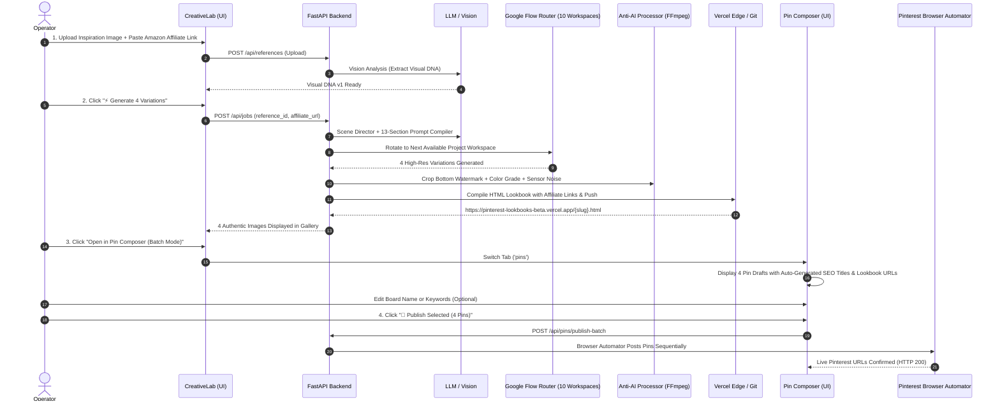

# 🎨 Pinterest Realism Engine (PRE) — Complete Frontend UI & Architecture Reference

This document is the **authoritative blueprint** for designing, structuring, styling, and extending the entire frontend application of the **Pinterest Realism Engine (PRE)**. It details every page, component, state, button action, API integration, and modal dialog.

---

## 1. 🏗️ Tech Stack & Design System Tokens

### 1.1 Technology Stack
- **Framework:** React 18 (with TypeScript)
- **Bundler:** Vite 5 (Proxy routes `/api/*` and `/data/*` to FastAPI backend at `http://127.0.0.1:8000`)
- **Iconography:** `lucide-react`
- **Carousels & Media:** `swiper` (Swiper.js v11)
- **Styling:** Vanilla CSS design tokens with Dark Glassmorphism aesthetic (`frontend/src/index.css`)

### 1.2 Global CSS Color & Design Tokens
```css
:root {
  /* Brand Accents */
  --brand-primary: #e60023;       /* Pinterest Signature Red */
  --brand-hover: #ad081b;
  --brand-glow: rgba(230, 0, 35, 0.35);

  /* Surface & Background Gradients */
  --bg-primary: #0d0f12;          /* App background */
  --bg-secondary: #13161b;        /* Card background */
  --bg-card: rgba(23, 27, 34, 0.75); /* Glassmorphic card */
  --bg-input: #1a1e26;           /* Inputs and textareas */

  /* Status Colors */
  --status-pass: #10b981;         /* Emerald Green (Verified / Published) */
  --status-warn: #f59e0b;         /* Amber Orange (Needs Attention / Pending) */
  --status-fail: #ef4444;         /* Coral Red (Error / Rework) */
  --status-info: #3b82f6;         /* Royal Blue (Router / Info) */
  --status-vault: #a855f7;        /* Obsidian Purple */

  /* Typography Colors */
  --text-primary: #f0f6fc;        /* Primary headings and active text */
  --text-secondary: #8b949e;      /* Subheadings and labels */
  --text-muted: #57606a;          /* Timestamps and placeholders */

  /* Borders & Shadows */
  --border-subtle: rgba(240, 246, 252, 0.1);
  --border-glow: rgba(230, 0, 35, 0.4);
  --radius-sm: 6px;
  --radius-md: 10px;
  --radius-lg: 16px;
  --radius-xl: 24px;
}
```

---

## 2. 🗺️ Navigation & Routing Map

The frontend is a single-page reactive dashboard with 4 core views and 5 global modal overlays managed by `App.tsx` state (`activeTab`).

```
App.tsx (Root Controller)
 │
 ├── Navbar.tsx (Sticky Header & Global Controls)
 │    ├── Brand Logo & v2.0 Badge
 │    ├── Tab Switcher (Dashboard | Creative Lab | Pin Composer | Obsidian Vault)
 │    └── Global Diagnostics Trigger ("Activity" icon ➔ DiagnosticsModal.tsx)
 │
 ├── View 1: Dashboard.tsx (`activeTab === 'dashboard'`)
 │    ├── Overall Metrics & Stage Counters (Waiting Flow, Passed, Reworks, Progress %)
 │    └── Quick Action Jump Buttons
 │
 ├── View 2: Creative Lab.tsx (`activeTab === 'lab'`)
 │    ├── Panel 1 (Left): Reference Upload, Style Extraction & Generation Trigger
 │    ├── Panel 2 (Right): 4-Variation Gallery, Wear-Test Lookbook Bar, Direct Publish
 │    ├── Modal 1: Flow Projects Router Manager Modal (`showProjectsModal`)
 │    ├── Modal 2: Subject Mismatch Guard Modal (`mismatch`)
 │    └── Modal 3: Single/Batch Schedule Modal (`scheduleModalOpen`)
 │
 ├── View 3: Pin Composer.tsx (`activeTab === 'pins'`)
 │    ├── Filter Tabs (Drafts | Scheduled Queue | Published History)
 │    ├── Batch Multi-Select & Bulk Apply Toolbar (Board, URL, Keywords)
 │    ├── 2-Column Pin Cards (9:16 Image Preview + Rich Metadata Editor)
 │    ├── Modal 4: Bulk Smart Scheduling Modal (`bulkOpen`)
 │    └── Live Publish Background Poller (`followRun`)
 │
 ├── View 4: VaultHub.tsx (`activeTab === 'vault'`)
 │    ├── Real-Time Obsidian Vault Sync Trigger
 │    ├── 3 Feature Explanation Cards (Graph View, Auto-Bug Logger, Templates)
 │    └── Vault Folder Structure Directory Index
 │
 └── Global Modal: DiagnosticsModal.tsx (`showDiagnostics === true`)
      ├── Subsystem Health Indicators (LLM, Flow, Pinterest, DB, Storage)
      └── 1-Click Interactive Diagnostic Probes (Test LLM, Test Flow, Test Pinterest)
```

---

## 3. 📄 Detailed Page-by-Page UI Specification

---

### Page 1: Top Navigation Bar (`Navbar.tsx`)

#### Purpose:
Always-visible global header providing brand identity, high-level workflow stage badges, tab switching, and live diagnostics access.

#### UI Elements & Button Actions:
| Element | Visual Appearance | Triggered Action / Behavior |
|---|---|---|
| **Brand Logo & Title** | Sparkles icon + "Pinterest Realism Engine v2.0" | Clicking resets `activeTab` to `'dashboard'`. |
| **Tab 1: Dashboard** | `Layers` icon + "Dashboard" | Sets `activeTab = 'dashboard'`. |
| **Tab 2: Creative Lab** | `Sparkles` icon + "Creative Lab" + Amber Badge | Sets `activeTab = 'lab'`. Shows numeric counter of jobs waiting for Flow. |
| **Tab 3: Pin Composer** | `Pin` icon + "Pin Composer" + Green Badge | Sets `activeTab = 'pins'`. Shows numeric counter of generated pins ready for review. |
| **Tab 4: Obsidian Vault** | `BookOpen` icon + "Obsidian Vault" | Sets `activeTab = 'vault'`. |
| **Diagnostics Button** | `Activity` icon + "Diagnostics & Probes" | Opens `DiagnosticsModal` (`showDiagnostics = true`). |

---

### Page 2: Dashboard Cockpit (`Dashboard.tsx`)

#### Purpose:
High-level overview of system throughput, campaign progress, and immediate shortcut triggers.

#### Key Sections:
1. **Hero Header Banner:**
   - Badge: `Phase 1 Vertical Slice Live`.
   - Title: "Pinterest Realism Engine Cockpit".
   - Subtitle: Explains reverse-engineered photographic DNA & affiliate workflow.
   - Primary CTA: **"Open Creative Lab ➔"** (`setActiveTab('lab')`).
   - Secondary CTA: **"Obsidian Graph ➔"** (`setActiveTab('vault')`).
2. **Metrics & Queue Summary:**
   - `waitingFlow`: Number of jobs currently generating in Google Flow.
   - `passedCritique`: Number of variations passing realism critic.
   - `reworkCount`: Number of variations needing prompt adjustment.
   - `progressPct`: Overall completion percentage of active campaigns.

#### API Calls:
- `api.getCampaigns()`: Loads active campaigns.
- `api.getJobs()`: Loads all jobs and counts active stage states.

---

### Page 3: Creative Lab (`CreativeLab.tsx`)
*(The Primary Generation & Visual Engine)*

```
┌──────────────────────────────────────┬────────────────────────────────────────────────────────┐
│ PANEL 1: Reference & Generation (Left)│ PANEL 2: 4-Variation Gallery & Publish Cockpit (Right) │
│                                      │                                                        │
│ 1. Reference Style                   │ 🔄 Vercel Lookbook Bar: [View Live Lookbook ↗]         │
│    [Reference Image Preview]         │                                                        │
│    [📁 1-Click Upload Dropzone]      │ Concept Tabs: [Desire] [Detail] [Lifestyle] [Discovery]│
│    🔗 Amazon Affiliate URL Input     │ Critic Badges: Photographic [9.4/10] Commerce [9.1/10] │
│    [Trend Label & Category Inputs]   │                                                        │
│    [⚡ Analyze Reference Button]     │ ┌───────────────────────┬────────────────────────────┐ │
│                                      │ │ 9:16 Active Creative  │ 1-Click Direct Publish Bar │ │
│ 2. Image Generation Trigger          │ │ Preview Image         │ • Board Selector Dropdown  │ │
│    • Backend Status Badges           │ │ • Crop & Analog Filter│ • ⚡ Publish Now Button    │ │
│    • 🔄 Flow Router: 10 Workspaces   │ │ • Download Button     │ • 📅 Schedule Pin Button   │ │
│      [Manage Workspaces Button]      │ └───────────────────────┴────────────────────────────┘ │
│    • Backend Dropdown (Auto/API/UI)  │                                                        │
│    • [⚡ Generate 4 Variations CTA]  │ 4 Thumbnail Selectors: [Thumb 1] [Thumb 2] [3] [4]     │
│                                      │ 13-Section Prompt Inspector: [Copy] [Open Flow]        │
└──────────────────────────────────────┴────────────────────────────────────────────────────────┘
```

#### Panel 1: Left Column Inputs
| Control / Button | Purpose | Underlying Mechanism |
|---|---|---|
| **Reference Image Box** | Shows thumbnail of active reference style photo | Displays `formatImgSrc(selectedRef.image_path)`. |
| **Upload Reference Dropzone** | File picker input for new Pinterest inspiration photo | `handleChooseFile` $\rightarrow$ `api.uploadReference` $\rightarrow$ auto-runs `api.analyzeReference` to extract Visual DNA. |
| **Amazon Affiliate Link Input** | Optional input field for Amazon Associate or merchant link | Saved into `Product.affiliate_url` and embedded automatically into all Lookbook CTAs. |
| **Analyze Reference Button** | Manually re-runs vision model analysis on reference | Calls `api.analyzeReference(id)` $\rightarrow$ produces Visual DNA v1/v2. |
| **Flow Router Status Strip** | Shows active workspaces count (e.g. `10 Workspaces (Load-Balanced)`) | Clicking **"Manage"** opens `FlowProjectsModal`. |
| **Backend Select Dropdown** | Choose between `Auto (Direct API -> Browser)`, `Flow UI`, `Flow API` | Sets `selectedBackend`. |
| **⚡ Generate 4 Variations Button** | **Primary Action Button:** Triggers 4-concept image generation | Calls `api.createJob({ reference_id, affiliate_url })` $\rightarrow$ `api.generate(jobId)`. |

#### Panel 2: Right Column 4-Variation Gallery
| Control / Button | Purpose | Underlying Mechanism |
|---|---|---|
| **Batch Switcher Dropdown** | Switch between recently generated batches | Calls `loadJob(jobId)` to switch active outputs. |
| **Open in Pin Composer ➔** | Transfers all 4 variations to Pin Composer in Batch Mode | Sets `activeTab = 'pins'`. |
| **New 4-Batch Button** | Clears outputs and triggers a fresh 4-variation batch | Calls `handleGenerateFlowBatch()`. |
| **Lookbook Live Status Bar** | Shows live Vercel lookbook bridge URL and status badge | Displays `jobPins[0]?.destination_url` with **"View Live Lookbook ↗"** button. |
| **Concept Selector Tabs** | Switch between `Desire`, `Detail`, `Lifestyle`, `Discovery` | Sets `selectedConcept` and updates prompt / critic details. |
| **4-Thumbnail Grid** | Visual selector for variation 1, 2, 3, or 4 | Sets `selectedOutputIndex` to preview high-res image. |
| **⚡ Publish to Pinterest Now** | 1-Click direct browser publication for the active image | Calls `api.directPublishNow(pinId, boardName)` and tracks progress. |
| **📅 Schedule Pin** | Opens Schedule Modal to queue pin for future posting | Opens `scheduleModalOpen` dialog. |
| **13-Section Prompt Box** | Displays exact photorealistic brief used in Google Flow | Includes **"Copy Prompt"** and **"Open Flow"** buttons. |

#### Modals in Creative Lab:
1. **Google Flow Projects Router Modal (`showProjectsModal`):**
   - Displays all active Google Flow workspaces in the pool.
   - Form to add new project URL: `https://labs.google/fx/tools/flow/project/<uuid>` (`api.addFlowProject`).
   - Remove button for each project (`api.removeFlowProject`).
2. **Subject Mismatch Guard Modal (`mismatch`):**
   - Appears if vision model detects reference image and product are different objects.
   - Option A: "Use this photo as the product" (`handleUseReferenceAsProduct`).
   - Option B: "Pick a different product".
   - Option C: "Generate anyway (style only)" (`handleGenerateAnyway`).
3. **Pin Schedule Modal (`scheduleModalOpen`):**
   - Datetime picker (`datetime-local`).
   - Option to schedule single pin or all 4 variations across consecutive peak hours.

---

### Page 4: Pin Composer (`PinComposer.tsx`)
*(The Batch Metadata Editor & Multi-Pin Publisher)*

```
┌───────────────────────────────────────────────────────────────────────────────────────────────┐
│ TOP BAR: [Drafts (4)] [Scheduled Queue (2)] [Published History (12)] • 🟢 Pinterest Connected │
├───────────────────────────────────────────────────────────────────────────────────────────────┤
│ BATCH TOOLBAR:                                                                                │
│ [X] Select All (4) • Board: [Fashion Trends ▼] • Lookbook URL: [https://... ] • Tags: [edit] │
│ [Apply to Selected]                      [🚀 Publish Selected (4 Pins)] [📅 Bulk Smart Schedule]│
├───────────────────────────────────────────────────────────────────────────────────────────────┤
│ PIN CARD 1 (Grid Item):                                                                       │
│ ┌──────────────────────┬────────────────────────────────────────────────────────────────────┐ │
│ │                      │ Title:       [Floral Patterned Summer Midi Dress - Viral Style    ]│ │
│ │ 9:16 Image Preview   │ Description: [Obsessed with the fit & flow of this midi dress...  ]│ │
│ │ [Variation #1]       │ Lookbook URL:[https://pinterest-lookbooks-beta.vercel.app/...html ]│ │
│ │ [Desire Concept]     │ Board:       [Just Random Photography                             ]│ │
│ │                      │ Keywords:    [#summerdress #cottagecore #tryonreview              ]│ │
│ │ [Download] [Preview] │ Buttons:     [💾 Save Edits] [⚡ Publish Single] [📅 Schedule]    │ │
│ └──────────────────────┴────────────────────────────────────────────────────────────────────┘ │
└───────────────────────────────────────────────────────────────────────────────────────────────┘
```

#### Key Sections & Features:
1. **View Filter Tabs:**
   - `Drafts`: Unposted pins ready for metadata editing.
   - `Scheduled Queue`: Pins scheduled for future posting with countdown timers.
   - `Published History`: Live pins with direct Pinterest URLs (`https://www.pinterest.com/pin/...`).
2. **Batch Multi-Select Toolbar:**
   - Checkbox to select all or individual pins.
   - Bulk Board setter dropdown.
   - Bulk Destination / Lookbook URL setter.
   - Bulk Keyword / Hashtag appender.
   - **"Apply to Selected"** button (`handleApplyBulkToSelected`).
   - **"🚀 Publish Selected (N Pins)"** button (`handleBatchPublishNow`).
   - **"📅 Bulk Smart Schedule"** button (`setBulkOpen(true)`).
3. **Per-Pin Rich Metadata Editor Card:**
   - **Visual Column (Left):** 9:16 WebP image preview, angle badge, quick download.
   - **Editor Column (Right):**
     - Title Input (SEO-optimized by stage 5 LLM).
     - Description Textarea (includes high-ranking search phrases and hashtags).
     - Destination URL Input (points to the live Vercel lookbook bridge page).
     - Pinterest Board Name Input/Dropdown.
     - Keywords tag pills.
     - Action buttons: "Save Edits" (`api.updatePinDraft`), "Publish Single" (`api.publishPinNow`), "Schedule" (`setScheduleModalOpen`).
4. **Bulk Smart Scheduling Modal (`bulkOpen`):**
   - **Spacing Modes:**
     - `Interval`: Post every N minutes (e.g. 60 min, 120 min).
     - `Time Slots`: Post at designated peak Pinterest hours (e.g. `09:00, 13:00, 18:00, 21:00`).
   - **Preview Button:** Calls `api.previewBulkSchedule()` to generate full calendar timeline.
   - **Confirm Button:** Calls `api.executeBulkSchedule()` to register jobs in the background scheduler.

---

### Page 5: Obsidian Knowledge Vault Hub (`VaultHub.tsx`)

#### Purpose:
Visual hub demonstrating real-time knowledge graph synchronization between SQLite and the operator's local Obsidian Vault.

#### UI Elements:
- **"⚡ Sync Vault Graph Now" Button:** Calls `POST /api/vault/sync` to generate updated markdown nodes for all campaigns, products, references, prompts, and bug reports.
- **Card 1: Interactive Graph View:** Instructions to open Obsidian (`Ctrl + G`) to view node links.
- **Card 2: Automated Bug Logging:** Explains `#bug/open` auto-incident reports.
- **Card 3: Pre-Built Templates:** 6 production templates ready in `07 - Templates/`.
- **Vault Directory Index:** Cards representing the 8 vault folders (`00 - Dashboard` through `07 - Templates`).

---

### Global Overlay: Diagnostics & Self-Healing Modal (`DiagnosticsModal.tsx`)

#### Purpose:
Real-time health checking and interactive connection probing across all 5 engine subsystems.

#### Subsystem Health Cards:
1. **LLM Provider (OpenCode / NVIDIA / Gemini):** Displays active provider, model name, and latency.
2. **Google Flow Session:** Displays session status, captured token presence, and Flow Router pool size (10 workspaces).
3. **Pinterest Browser Session:** Displays authenticated profile status, default board, and Chrome user data path.
4. **Database & Storage:** Displays SQLite path, connection status, outputs directory, and lookbook file counts.
5. **Interactive Diagnostic Buttons:**
   - **"Probe LLM"** (`api.testLLM()`)
   - **"Probe Flow Session"** (`api.testFlowSession()`)
   - **"Probe Pinterest Profile"** (`api.testPinterestSession()`)

---

## 4. 🔌 Complete API Client Reference (`frontend/src/api.ts`)

Every API endpoint connected to the frontend:

| API Method in `api.ts` | HTTP Route | Used By Component | Purpose |
|---|---|---|---|
| `getCampaigns()` | `GET /api/campaigns` | `Dashboard` | Fetch campaign list |
| `getReferences()` | `GET /api/references` | `CreativeLab` | Fetch reference photos |
| `uploadReference(formData)` | `POST /api/references` | `CreativeLab` | Upload inspiration image |
| `analyzeReference(id)` | `POST /api/references/{id}/analyze` | `CreativeLab` | Run vision model for Visual DNA |
| `updateVisualDNA(id, dna)` | `PUT /api/references/{id}/dna` | `CreativeLab` | Save manual Visual DNA edits |
| `createJob(data)` | `POST /api/jobs` | `CreativeLab` | Create generation job with affiliate URL |
| `getJobs(state?)` | `GET /api/jobs` | `Dashboard`, `CreativeLab` | Fetch job list |
| `getJob(id)` | `GET /api/jobs/{id}` | `CreativeLab` | Fetch job details with outputs & concepts |
| `generate(jobId, options)` | `POST /api/jobs/{id}/generate` | `CreativeLab` | Start generation on chosen backend |
| `getGenerationBackends()` | `GET /api/jobs/generation/backends` | `CreativeLab` | Check status of Flow API & UI |
| `getFlowProjects()` | `GET /api/jobs/flow/projects` | `CreativeLab` | Get list of 10+ Flow workspaces |
| `addFlowProject(url)` | `POST /api/jobs/flow/projects` | `CreativeLab` | Add new Flow workspace URL to router |
| `removeFlowProject(uuid)` | `DELETE /api/jobs/flow/projects/{uuid}` | `CreativeLab` | Remove Flow workspace URL |
| `generateLookbook(jobId, url)` | `POST /api/jobs/{id}/lookbook` | `CreativeLab` | Re-generate & deploy Vercel lookbook |
| `getPins(view?)` | `GET /api/pins` | `PinComposer`, `CreativeLab` | Fetch drafts, scheduled, or published pins |
| `updatePinDraft(id, data)` | `PUT /api/pins/{id}` | `PinComposer` | Save edited title, desc, url, board |
| `batchUpdatePinDrafts(items)` | `PUT /api/pins/batch` | `PinComposer` | Bulk update multiple pins |
| `directPublishNow(pinId, board)`| `POST /api/pins/{id}/publish` | `CreativeLab`, `PinComposer` | Publish single pin via browser |
| `batchPublishNow(pinIds, board)`| `POST /api/pins/publish-batch` | `PinComposer` | Publish multiple pins in batch run |
| `getPublishRun(runId)` | `GET /api/pins/runs/{runId}` | `PinComposer` | Poll live publishing progress |
| `schedulePin(pinId, date)` | `POST /api/pins/{id}/schedule` | `CreativeLab`, `PinComposer` | Queue single pin for scheduled drop |
| `previewBulkSchedule(options)` | `POST /api/pins/schedule-bulk/preview` | `PinComposer` | Preview smart scheduling slots |
| `executeBulkSchedule(options)` | `POST /api/pins/schedule-bulk` | `PinComposer` | Enqueue multiple scheduled pins |
| `checkPinterestAuth()` | `GET /api/pins/auth/status` | `CreativeLab`, `PinComposer` | Verify Pinterest login session |
| `getSystemStatus()` | `GET /api/debug/system-status` | `DiagnosticsModal` | Run full health diagnostics |
| `testLLM()` | `POST /api/debug/test-llm` | `DiagnosticsModal` | Test LLM response & latency |
| `testFlowSession()` | `POST /api/debug/test-flow-session` | `DiagnosticsModal` | Test Google Flow session headers |
| `testPinterestSession()` | `POST /api/debug/test-pinterest-session`| `DiagnosticsModal` | Test Pinterest browser profile |

---

## 5. 🔄 End-to-End User Interaction Flow



---

## 6. 💡 Key Guidelines for Redesigning the UI

When redesigning or customizing the frontend components:
1. **Maintain URL & Affiliate Flow:** Always ensure the `affiliate_url` input is passed when creating jobs so the Lookbook generator automatically hyperlinks every CTA button to the operator's merchant link.
2. **Keep the Flow Router Visible:** Keep the `Flow Router: 10 Workspaces` status and `Manage` modal accessible so the operator can expand their workspace pool anytime.
3. **Use Batch Multi-Select in Pin Composer:** Ensure operators can edit and publish either **1 pin at a time** or **all 4 variations simultaneously**.
4. **Preserve Anti-AI Preview URLs:** All images rendered in the UI come from `/data/outputs/{job_id}/flow_var_{i}.jpg` which have already undergone the FFmpeg watermark removal and color grading filters.
